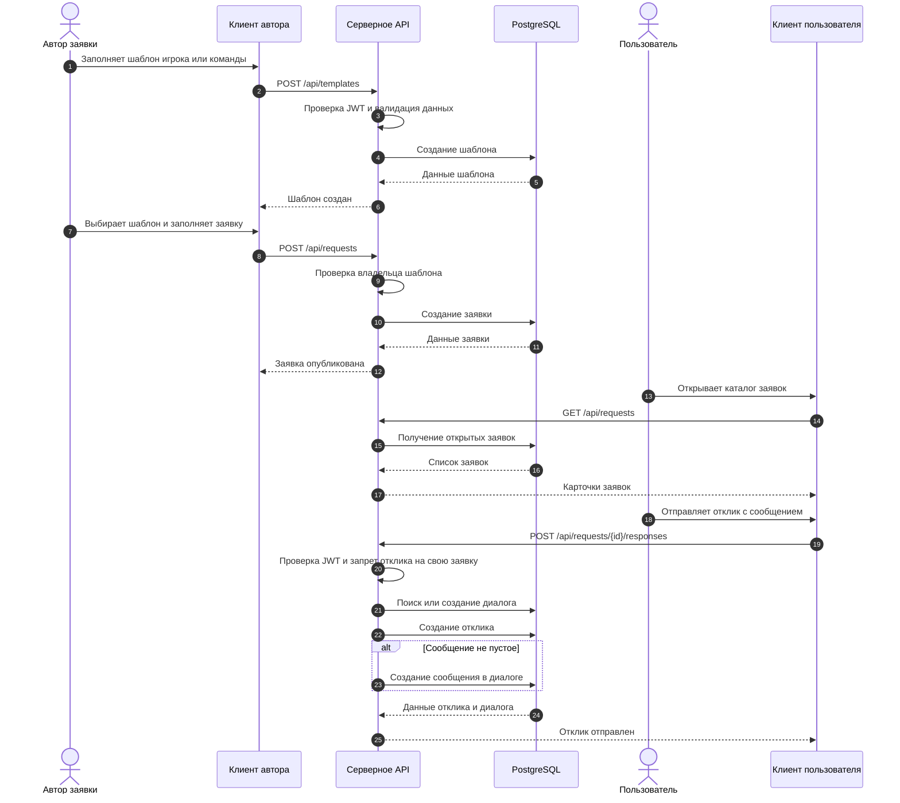

# 2.4 Проектирование ключевого сценария взаимодействия

Для уточнения логики взаимодействия между клиентской частью, сервером и базой данных используется диаграмма последовательности. В качестве ключевого сценария выбран процесс публикации заявки на основе заранее созданного шаблона и последующий отклик другого пользователя. Данный сценарий отражает основную идею разрабатываемого приложения: пользователь не заполняет все данные заново при каждой публикации, а использует подготовленный игровой шаблон.

Сначала пользователь создает шаблон игрока или команды, указывая игру, роль, ранг, расписание и описание. После этого на основе выбранного шаблона формируется заявка. Серверная часть проверяет авторизацию пользователя, валидирует входные данные и сохраняет сведения в базе данных. Другой пользователь может просмотреть опубликованную заявку и отправить отклик. При создании отклика система создает или использует существующий диалог между автором заявки и пользователем, отправившим отклик. Если в отклике указан текст сообщения, он сохраняется как первое сообщение в диалоге.

`[Место для рисунка]`

`Рисунок 2.4 — Диаграмма последовательности создания заявки и отправки отклика`

Код диаграммы для Mermaid Live:

Представленный сценарий показывает, что клиентская часть отвечает за ввод данных и отображение результата, серверная часть выполняет проверку прав и бизнес-логику, а база данных хранит шаблоны, заявки, отклики, диалоги и сообщения. Такая последовательность соответствует выбранной клиент-серверной архитектуре и структуре данных приложения.

Источник для пункта:

[1] Коваленко М.А., Аппатов А.Н. Разработка клиент-серверных приложений: Методические указания. — М.: МИРЭА-Российский технологический университет, 2023.
